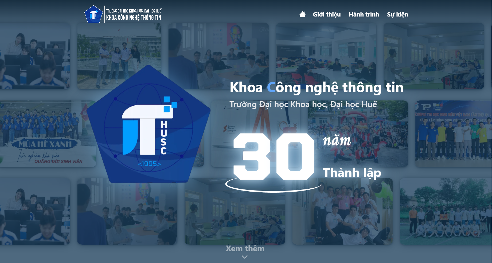

# IT HUSC 30th Anniversary Landing Page

A modern, animated landing page built to celebrate the 30th anniversary of the Faculty of Information Technology, University of Sciences, Hue University.



## Highlights

- Built with Next.js 14 and TypeScript
- Smooth section-based navigation with scroll interactions
- Animated timelines and transitions (Framer Motion + AOS)
- Responsive layout for desktop and mobile
- Styled with Tailwind CSS, NextUI, and Sass

## Tech Stack

- Next.js
- React
- TypeScript
- Tailwind CSS
- NextUI
- Framer Motion
- AOS
- React Scroll
- React Vertical Timeline Component
- Sass

## Getting Started

### Prerequisites

- Node.js 18+ (recommended: latest LTS)
- pnpm

### Install

```bash
pnpm install
```

### Run in development

```bash
pnpm dev
```

The app runs at `http://localhost:3030`.

### Build for production

```bash
pnpm build
pnpm start
```

## Project Structure

```text
app/                 # Next.js app router entry files
layouts/             # Main page layout and sections (Home, About, Itinerary, Event)
components/          # Shared UI components
styles/              # Global styles, animations, fonts
config/              # Static metadata and JSON data
assets/              # Images and static design assets
```

> [!NOTE]
> This project was created for a university anniversary campaign and focuses on visual storytelling, smooth interactions, and section-based content flow.
